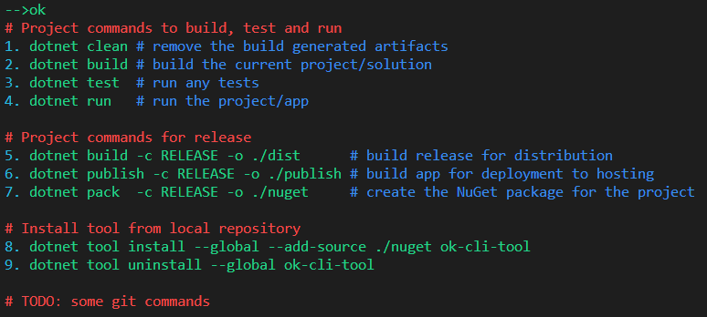

# ok-cli-tool

[](https://www.nuget.org/packages/ok-cli-tool/)

[](https://github.com/algonzalez/ok-cli-tool/blob/master/LICENSE.txt)


A dotnet core command line tool to work with '.ok' files as described in '[I'm .ok you're .ok: introducing folder profiles for bash and powershell](http://secretgeek.net/ok)' by Leon Bambrick (aka secretGeek).

> Take a look at secretGeek's '["ok" folder profiles for bash](https://github.com/secretGeek/ok-bash)' if you prefer working in `Bash`; or his '["ok" folder profiles for powershell](https://github.com/secretGeek/ok-ps)' if you are more of a `PowerShell` aficionado.

Basically, the '.ok' file will contain a list of one-line commands that are relevant to the folder in which it resides. The `ok` tool will list the available commands and allow you to run them by associated number. 

> **NOTE:** A goal is for this tool to run cross-platform (Windows, Linux and macOS). I no longer have access to a Mac so I'll have to rely on others for testing on macOS.

## Installation

To install it from NuGet, run the following command:

```
dotnet tool --global ok-cli-tool
```

To install it from a local git repository clone:
```
dotnet build -o ./dist
dotnet tool --global --add-source ./dist ok-cli-tool
```

## Usage

Assume that you are in a dotnet core project directory, and have the following '.ok' file:

```
# Project commands to build, test and run
dotnet clean    # remove the build generated artifacts
dotnet build    # build the current project/solution
dotnet test     # run any tests
dotnet run      # run the project/app

# Project commands for release
dotnet build -c RELEASE -o ./dist   # build release for distribution
dotnet publish -c RELEASE -o ./publish  # build app for deployment to hosting
dotnet pack  -c RELEASE -o ./nuget  # create the NuGet package for the project

# Install tool from local repository
dotnet tool install --global --add-source ./nuget ok-cli-tool
dotnet tool uninstall --global ok-cli-tool

# TODO: some git commands
```

When you run `ok`, you should see something like this:



Now when I run `ok 6`, the current code will be packaged for deployment into the './publish' directory.

To see available options, run `ok --help`. Add the verbose option `ok --help --verbose` to see what environment variable settings are availabe. 

## License

[MIT](LICENSE.txt)
